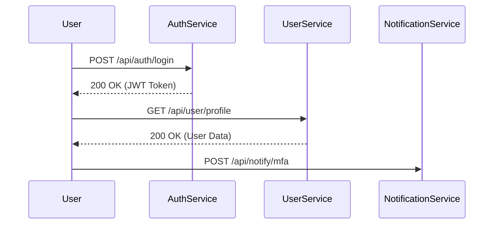
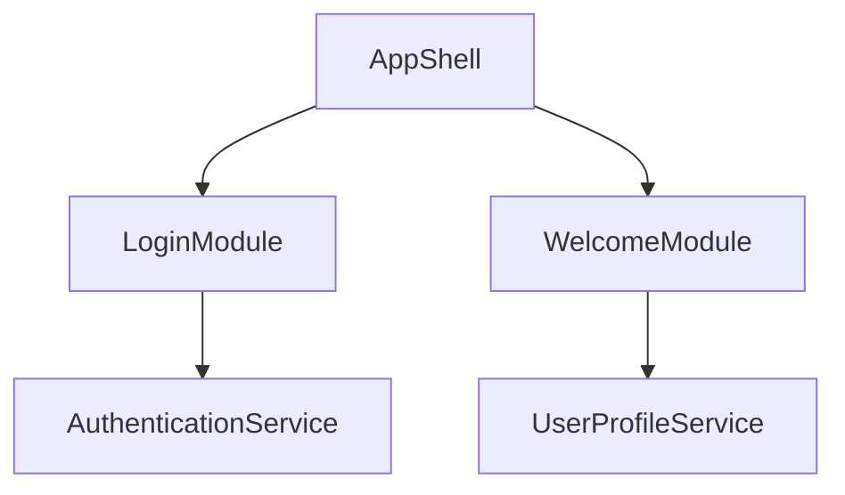

<!-- saved_by=api pipeline='orchestrated:multi' utc=2026-04-22T13:38:04Z -->

# Orchestrated run

**Planner rationale:** This plan outlines the necessary steps to create a simple Android login page that meets the specified requirements, ensuring a smooth transition to the welcome screen upon successful login.

**Steps:** 8


---


## Step 1: `mobile_architecture_agent` / `mob_stack_architecture`


# Mobile Architecture for Android - Login Page Functionality

## Executive Summary
This document outlines the mobile system architecture for the Android application, with a specific focus on the login page functionality. It aims to strike a balance between immediate implementation needs and long-term maintainability, ensuring flexibility for future features while adhering to best practices in security and user experience.

## Platform Strategy
| Criteria                  | Native (Kotlin)               | Cross-Platform (React Native/Flutter) |
|---------------------------|-------------------------------|---------------------------------------|
| Development Speed         | Slower due to native coding   | Faster implementation with shared code|
| Performance               | Optimal performance            | Slightly lower than native            |
| UI Consistency            | Native UI components           | UI components may differ slightly     |
| Access to Device Features  | Full access                   | Limited based on framework capabilities|
| Community Support         | Strong community               | Growing community                     |
| Maintenance               | More complex                   | Easier due to shared code             |

## App Modules and Navigation
1. **Modules:**
   - **Login Module**: Input fields for username and password, login button, and links to registration and password recovery.
   - **Home Module**: Represents the main application interface after successful login.
   - **Error Handling Module**: Displays error messages for invalid login attempts.

2. **Navigation Strategy**:
   - **Single Activity Architecture**: Use a single activity with multiple fragments for efficient state management.
   - **Navigation Component**: Utilize Android's Navigation Component for handling fragment transitions and passing data.

## Local Data & Offline
- **Storage Mechanism**: Use SharedPreferences for lightweight data storage like tokens.
- **Offline Access**: Implement a caching mechanism using Room database to allow login attempts even without network connectivity. Sync user data upon reconnection.

## Push & Deep Links
- **Push Notification Integration**: Utilize Firebase Cloud Messaging (FCM) for sending notifications.
- **Deep Linking**: Implement deep links to allow users to easily return to the login screen from notifications.

## Biometrics/Secure Storage
- **Biometric Authentication**: Integrate Fingerprint/Face Recognition APIs for enhanced security during login.
- **Secure Storage**: Use Android Keystore System to store sensitive data like user credentials securely.

## Networking & API Client
- **Networking Library**: Implement Retrofit for handling API calls, with a focus on the authentication endpoint.
- **Authentication Flow**: Use OAuth 2.0 for secure authentication, providing a seamless login experience with token management.

## Build/Environment Strategy
- **Build Flavors**: Create different flavors for Development, Staging, and Production environments. This ensures isolation of resources and prevents errors during deployment.
- **CI/CD Process**: Implement a CI/CD pipeline using tools like GitHub Actions or Bitrise to automate testing and deployments.

## Test Strategy Outline
- **Unit Testing**: Write unit tests for all business logic using JUnit.
- **UI Testing**: Utilize Espresso for testing user interactions on the login page.
- **Integration Testing**: Ensure API integrations are working as expected with mock responses.

## Open Risks & Decisions
- **Compliance Risks**: Ensure compliance with Google Play policies regarding sensitive data processing.
- **User Experience Risks**: Monitor user feedback related to the login process to identify potential improvements.

---

This document serves as a foundational guide for developing the mobile architecture of the Android application, particularly for the login page functionality. Ensure to periodically review and update the architecture as needed based on evolving features, user feedback, and technology advancements.


## Step 2: `design_agents` / `dg_wireframe_spec`


# Low-Fidelity Wireframe Specification for Simple Login Screen

## Screen Inventory
1. **Login Screen**

## Per-Screen Layout Description

### 1. Login Screen
- **Header:**
  - Title: "Login" (Centered, bold, 24pt font)
  
- **Main Content Area:**
  - **Username Field:**
    - Type: Text Input
    - Placeholder Text: "Username" (Light gray text)
    - Layout: Positioned centrally, with enough padding around the field.
  
  - **Password Field:**
    - Type: Password Input
    - Placeholder Text: "Password" (Light gray text)
    - Layout: Positioned directly below the username field, aligned centrally.

  - **Login Button:**
    - Text: "Login" (Centered, bold)
    - Type: Button
    - Layout: Positioned directly below the password field, taking the full width of the screen.

- **Footer:**
  - Links: "Forgot Password?" (aligned left, smaller text), and "Sign Up" (aligned right, smaller text).

## User Flows
1. **Login Flow:**
   - User opens the app → User is presented with the Login Screen.
   - User enters their username and password → User clicks the "Login" button → 
     - If credentials are correct, navigate to the dashboard/home screen.
     - If credentials are incorrect, display an error message: "Invalid username or password."
  
2. **Forgot Password Flow:**
   - User clicks on "Forgot Password?" link → Navigate to the password recovery screen.

3. **Sign Up Flow:**
   - User clicks on "Sign Up" link → Navigate to the registration screen.

## Empty/Loading/Error States
- **Empty States:**
  - Both fields are empty: Placeholder text is visible, with no error messages.
   
- **Error State:**
  - If the user attempts to login without filling either field, show a message: "Please fill in both fields."
  - If incorrect credentials are provided, display: "Invalid username or password."
  
- **Loading State:**
  - When the user clicks "Login", a loading spinner appears on the button until the verification process is complete.

### Additional Considerations
- Ensure accessibility by using appropriate labels and color contrasts.
- The fields must be large enough for easy touch interaction, especially on mobile devices.
- The login button should have a clear call-to-action design to encourage user engagement.


## Step 3: `design_agents` / `dg_visual_ui`


# Visual Design Specification for Android Login Screen

## Visual Principles
- Follow Android’s Material Design principles for consistency, usability, and accessibility.
- Aim for a modern and clean aesthetic that feels intuitive.
- Utilize whitespace effectively to avoid clutter and enhance focus on input fields and call-to-action buttons.

## Color & Typography
### Color Palette
- **Primary Color**: Use a shade of blue (e.g., #6200EE) as a primary action color for the login button.
- **Secondary Color**: A lighter shade (e.g., #BB86FC) for tonal contrast.
- **Background Color**: Utilize a light grey (e.g., #FFFFFF) for the background or a dark grey (e.g., #121212) for dark mode.
- **Text Color**: Standard text in dark grey (e.g., #000000) or white for dark mode (e.g., #FFFFFF).
- **Error Color**: Red (e.g., #B00020) for error messages with accompanying text.

### Typography
- **Font Family**: Use Google's Roboto font for a clean and modern approach.
- **Heading Size**: 24px, bold for the title.
- **Input Labels**: 16px, medium for readability.
- **Body Text**: 14px for general instructions and error messages.
- Ensure line height is at least 1.5 for readability.

## Spacing
- **Margin**: Use consistent margins of at least 16px around outer elements.
- **Padding**: Input fields should have 12px padding both vertically and horizontally.
- **Element Spacing**: Maintain a consistent 8px vertical spacing between input fields, buttons, and text for a clean layout.

## Key Components & States
### Components
- **Text Fields**: 
  - Field for Email: Placeholder "Email", accessible by labels.
  - Field for Password: Placeholder "Password", with 'show/hide password' feature.
- **Login Button**: 
  - Prominent button with text "Log In", uses primary color for visibility.
- **Reset Password Link**: 
  - A small, underlined text link positioned below the login button.

### Component States
- **Default State**: Regular color scheme as defined above.
- **Hover State**: Slightly darker background color for buttons (e.g., #3700B3) when hovered.
- **Focus State**: Highlight input fields with an outline (2px solid primary color) when selected.
- **Error State**: Input fields should highlight in red with a tooltip or message below the field explaining the error.

## Responsive Notes
- Ensure that the layout adjusts smoothly from small mobile screens (360px) to larger screens (600px and above).
- Buttons and input fields should maintain sufficient touch targets of at least 48x48dp.
- Text resizing should remain legible on all screen sizes, adhering to responsive typography standards.

## A11y Notes
- Confirm that text color contrast ratios meet WCAG AA standards (minimum 4.5:1 for normal text).
- All actionable elements must be keyboard navigable and focused visibly for keyboard users.
- Use `aria-labels` for additional clarity on input fields.
- Include descriptive error messages that are announced to screen readers when a field error occurs.

## Open Questions
- Are there specific branding elements or logos that need to be incorporated?
- Should the design accommodate additional accessibility features outside of standard guidelines)?


## Step 4: `project_management_agents` / `pm_backend_architecture`


# Backend Architecture for User Authentication in Android App

## Overview
This document outlines the backend architecture needed to support user authentication for an Android application. It will detail services, integration points, API surface, and operational considerations.

## 1. Services

### Core Services
- **Auth Service**: Responsible for user authentication (login, registration, token generation).
- **User Service**: Manages user-related data (CRUD operations for user profiles).
- **Notification Service** (Optional): Sends notifications such as multi-factor authentication (MFA) codes or password reset links.

## 2. API Surface
### REST API Endpoints
| Endpoint                    | Method | Description                          |
|----------------------------|--------|--------------------------------------|
| `/api/auth/register`       | POST   | User registration                    |
| `/api/auth/login`          | POST   | User login                           |
| `/api/auth/logout`         | POST   | User logout                          |
| `/api/auth/token/refresh` | POST   | Refresh authentication token         |

### Sample API Response for Login
```json
{
  "token": "JWT_TOKEN_HERE",
  "expiresIn": 3600,
  "user": {
    "id": 1,
    "email": "user@example.com"
  }
}
```

## 3. Authentication and Authorization (AuthN/Z)
- Implement **OAuth 2.0** for secure authorization.
- Utilize **JWT** (JSON Web Tokens) for stateless authentication.
- Define scopes for API access control based on user roles.

## 4. Data Access Pattern
- **Database**: Use a relational database (e.g., PostgreSQL) for user data.
- **Caching Layer**: Implement caching (e.g., Redis) for session management and token validation to improve performance.

## 5. Background Jobs
- **Email Service**: Background jobs for sending emails for:
  - Multi-factor authentication (MFA) codes.
  - Password reset emails.

## 6. Idempotency and Retries
- Ensure idempotency for registration and login actions to handle retries safely.
- Implement exponential backoff for retry logic on transient failures (e.g., network issues).

## 7. Observability
- Integrate logging (e.g., ELK stack) to track user sign-ins, errors, and API performance.
- Use analytics tools to monitor user engagement and authentication flows.

## 8. Deployment Topology
- **Cloud Deployment**: Consider deploying services on cloud infrastructure (e.g., AWS, Azure) for scalability.
- **On-Premises**: Alternatively, ensure compliance with organizational and data protection policies if on-prem infrastructure is required.



## Conclusion
This architecture provides a scalable and secure solution for user authentication in an Android app. Key considerations include using standard protocols for AuthN/Z, ensuring data access efficiency, integrating observability for monitoring, and providing a well-defined API surface for frontend interactions.

## Open Questions for Validation:
- Are there any specific compliance standards that need to be considered? 
- Is there an existing user database structure or service integration that should be taken into account?


## Step 5: `project_management_agents` / `pm_frontend_architecture`


# Frontend Architecture for Android Login Page and Welcome Screen Transition

## 1. App Structure
The Android app will follow a modular architecture with a focus on maintainability and scalability. The key components include:
- **App Shell**: This serves as the core of the application, managing overall application state and providing shared resources (e.g., theming, navigation).
- **Modules**: Each feature (e.g., login, welcome) is encapsulated in its own module, allowing for easy updates and testing.

**Component Boundary Diagram**:


## 2. Routes and Navigation
Navigation will utilize Android's Jetpack Navigation Component for a seamless transition between the login page and the welcome screen.
- **Login Route**: `/login`
- **Welcome Screen Route**: `/welcome`

### Navigation Flow:
- On successful login, navigate from the Login page to the Welcome screen using the navigation action that pops the login fragment from the back stack.

## 3. State Strategy
State management for the UI-related data will be handled using:
- **ViewModel**: Utilize Android's ViewModel to store and manage UI-related data in a lifecycle-conscious way. This ensures data survives configuration changes like screen rotations.

## 4. Form and Validation
The login form will include:
- **Input Fields**: For username and password.
- **Validation Logic**: Implement validation rules that check for empty fields and enforce password complexity.
- **Error Messages**: Provide real-time feedback for validation errors alongside the input fields.

### Form Strategy:
- Use Data Binding to link the UI components with the ViewModel for two-way data binding, ensuring the UI reflects the state of the ViewModel.

## 5. Error Handling
- Implement a centralized error handling strategy that catches exceptions during login attempts and displays user-friendly messages (e.g., "Incorrect username or password").
- Utilize Snackbar for transient error messages on the UI.

## 6. i18n/a11y Hooks
- **Internationalization (i18n)**: Use resource files for strings to support multiple languages.
- **Accessibility (a11y)**: Ensure all UI elements are accessible, providing content descriptions and appropriate focus management given screen changes.

## 7. Caching
- Implement caching mechanisms using Room Database to store user information, enabling quicker access to previously logged in users and improving performance when navigating back to the login screen.

## 8. Testing Pyramid
- **Unit Tests**: Approach will focus on testing ViewModels and utility functions related to form validation and error handling.
- **Integration Tests**: Test interactions between UI components and ViewModels.
- **End-to-End (E2E) Tests**: Use Espresso for testing the complete login flow from UI to backend response.

---

### Open Questions:
1. Are there any specific design system components that must be included beyond standard Material Design?
2. Should the app support any additional features on the welcome screen that might affect the architectural decisions?


## Step 6: `devops_platform_agents` / `dvp_cicd_pipeline_design`


# High-Level CI/CD Design for Android Application

## Stages
1. **Build**:  
   - Utilize **Gradle** as the build tool for compiling the Android application and generating APK outputs.
  
2. **Test**:  
   - Implement unit and integration tests using **JUnit** and **Espresso** to ensure functional correctness.
   - Run UI tests to validate user interactions and flows within the application.
  
3. **Security Scans**:  
   - Integrate **OWASP ZAP** for dynamic security testing and **SonarQube** for static code analysis to detect vulnerabilities in code.

4. **Approval Gates**:  
   - Introduce manual approval gates post-security scans and before production deployments, ensuring that only vetted changes are promoted.

5. **Deployment**:  
   - Automate deployment to different environments:
     - **Development**: Automatically deploy on every commit.
     - **Staging**: Deploy upon successful integration tests and approve manually before promoting to production.
     - **Production**: Manual deployment after successful testing and approvals.

## Quality Gates
- **Code Quality**: Static analysis must pass with a minimum threshold (e.g., maintainability, code smells).
- **Test Coverage**: Enforce at least 80% unit test coverage.
- **Security Scans**: No critical vulnerabilities should be reported by OWASP ZAP or SonarQube.

## Secrets Strategy
- Use **HashiCorp Vault** or **AWS Secrets Manager** to securely store and manage sensitive information such as API keys and database credentials.
- Follow best practices for access policies, ensuring only necessary services and personnel have access to secrets.

## Environments
- **Development**: Where developers can continuously integrate code.
- **Staging**: Represents production-like conditions for thorough testing.
- **Production**: The live application available to end-users.

## Release Strategy
- **Automated Steps**:
  - Continuous Delivery (CD) approach to release code changes to development and staging automatically upon passing tests.
- **Manual Steps**:
  - Manual promotion to production, triggered by an approval from a designated team member. Rollback plans should be in place in case of failures.

## Risks
- **Security Risks**: Ensure adherence to secure coding practices and regular review of dependencies.
- **Compliance Risks**: Keep abreast of regulations that might affect data handling or application deployment.
- **Dependency Management**: Monitor and manage third-party libraries to mitigate vulnerabilities.

## Metrics to Track
- **Deployment Frequency**: Track how often deployments occur.
- **Change Failure Rate**: Monitor the percentage of changes that fail.
- **Mean Time to Recovery (MTTR)**: Calculate how quickly the application can recover from failed deployments.
- **Test Coverage**: Maintain the target coverage requirement and monitor trends over time.

Open Questions:
1. What specific compliance requirements need to be adhered to for the Android application?
2. Are there any existing tools for CI/CD already in use within the organization that could be integrated?
3. Who will be responsible for the management and oversight of the secrets strategy?


## Step 7: `qa_test_strategy_agents` / `qts_test_plan`


# Master Test Plan for Login Functionality

## Objectives
To validate the login functionality of the Android application, ensuring robust testing of both successful and unsuccessful login attempts to meet governance and guardrails requirements.

## In/Out of Scope
### In Scope
- Successful login attempts with valid credentials.
- Unsuccessful login attempts, including:
  - Invalid username.
  - Invalid password.
  - Inactive user accounts.
  - Network errors during login attempts.

### Out of Scope
- Other application functionalities (e.g., logout, password recovery).
- Testing sessions beyond the login screen.

## Test Levels
- **Unit Testing**: Validate individual components of the login functionality (e.g., input fields, validation logic).
- **Integration Testing**: Test interactions between the login component and the back-end authentication service.
- **End-to-End (E2E) Testing**: Simulate user journeys for both successful and unsuccessful login attempts on the actual Android device.

## Environments
Testing should occur in environments that closely mimic the production setup, including:
- Development Environment
- Testing Environment
- Staging Environment (for E2E testing)

## Data & Privacy
- Use mock data for testing user credentials to protect privacy and comply with data protection regulations.
- Ensure that user authentication tokens are handled securely, avoiding any exposure during testing.

## Test Cases Outline
| Test Case ID | Description                        | Expected Result                                        | Status  |
|---------------|------------------------------------|-------------------------------------------------------|---------|
| TC-001        | Successful login with valid creds | User is redirected to the dashboard after login.     | Not Executed |
| TC-002        | Unsuccessful login with invalid username | Error message displayed: "Invalid username."    | Not Executed |
| TC-003        | Unsuccessful login with invalid password | Error message displayed: "Incorrect password."     | Not Executed |
| TC-004        | Unsuccessful login inactive account | Inform the user that their account is inactive.     | Not Executed |
| TC-005        | Handle network error during login | Error message displayed: "Please check your internet connection." | Not Executed |

## Defect & Exit Criteria
- **Defect Reporting**: Defects must be logged in a tracking system and prioritized based on their severity.
- **Exit Criteria**: Testing can be concluded when:
  - All critical test cases (successful/unsuccessful login) are executed.
  - All high-severity defects are resolved and validated.
  - No critical or high-priority defects remain unaddressed.

## Reporting
- Test results will be recorded and reported in a structured format, highlighting passed/failed test cases.
- A summary report will be created at the end of the testing phase, including metrics on test coverage and defect status.

## Assumptions
- Valid user credentials for testing are assumed to be available.
- No critical system changes will occur during the testing phase to ensure stability.

## Open Questions for Validation
- Are there specific error messages required for unsuccessful login attempts?
- Is there a need for localization support in the login error messages?
- Will performance testing be needed for high-volume authentication scenarios?


## Step 8: `release_distribution_agent` / `rel_app_distribution`


# Android App Release and Distribution Strategy

## 1. Pipelines
- **Establish CI/CD Pipelines**: 
  - Set up automated pipelines that handle building, testing, and deployment of the app across various environments (development, staging, production).
  - Integrate unit tests and UI tests within the pipeline to ensure quality at every stage.

## 2. Branching
- **Version Control Strategy**: 
  - Utilize Git branching strategies such as GitFlow or trunk-based development to manage releases.
  - Define branches for feature development, staging, and production, ensuring seamless merging and conflict resolution.

## 3. Environment Promotion
- **Staging to Production Process**:
  - Create distinct environments: Development, Staging, Production.
  - Implement gate checks for code quality (e.g., automated tests, code reviews) and performance at each stage of promotion.

## 4. Mobile Signing Overview
- **Signing and Provisioning**:
  - Outline the signing process, including managing Keystore and certificates securely (e.g., use of tools for secrets management).
  - Ensure compliance with Android’s security requirements for app signatures.

## 5. Beta Distribution
- **Testing Tracks in Google Play Console**:
  - Utilize different beta testing tracks: Closed Track for select testers, Open Track for broader audience testing, Internal Testing for rapid feedback.
  - Gather usability and performance feedback to inform final adjustments before public release.

## 6. Store Submission
- **Google Play Store Submission Process**:
  - Define a schedule for store submissions (e.g., bi-weekly or monthly).
  - Prepare for app review risks by ensuring compliance with Play Store policies, including appropriate metadata and promotional materials.

## 7. Feature Flags and Kill Switches
- **Implement Feature Flags**:
  - Use feature toggles to control the visibility of new features during the rollout.
  - Ensure there are procedures for a 'kill switch' to quickly disable features if critical issues are detected post-release.

## 8. Rollback
- **Rollback Strategy**:
  - Establish clear versioning practices (e.g., Semantic Versioning) to facilitate quick rollback of versions if needed.
  - Maintain a backup of the last safe version always ready for redeployment in the event of a critical failure.

## 9. Operational Checklist
- **End-of-Release Checklist**:
  - Ensure all documentation is updated, including release notes and API documentation.
  - Confirm that all metrics and analytics are working post-release for monitoring app performance.
  - Conduct a post-mortem analysis for each release to continually improve the process.

## 10. Open Risks
- **Identify Risks**:
  - The rapid pace of releases may overwhelm QA resources; mitigate by balancing features and bug fixes.
  - Keeping track of dependencies between feature flags and ensure thorough testing across all combinations before release.

--- 
This strategy ensures a safe and efficient release process for the Android app while leveraging best practices in continuous delivery. The team should regularly review and adapt this strategy to meet evolving requirements and feedback.
